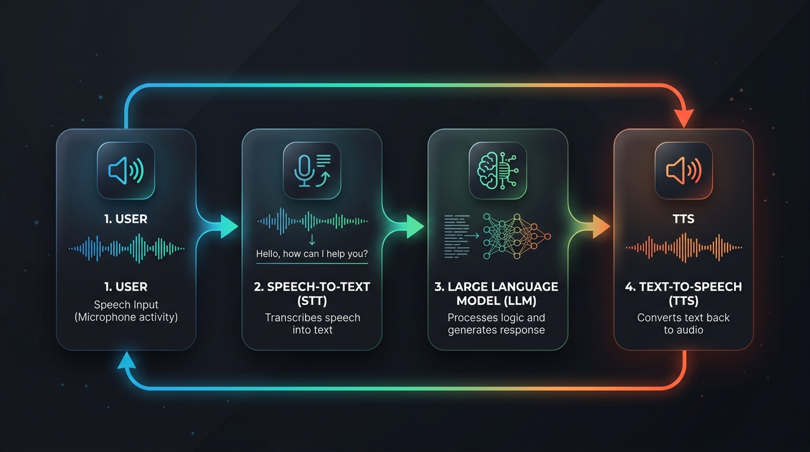
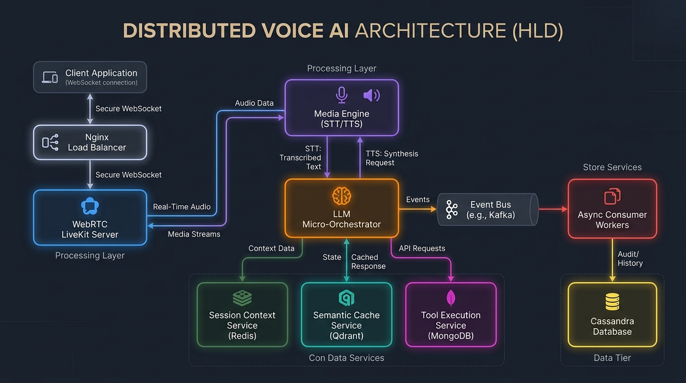
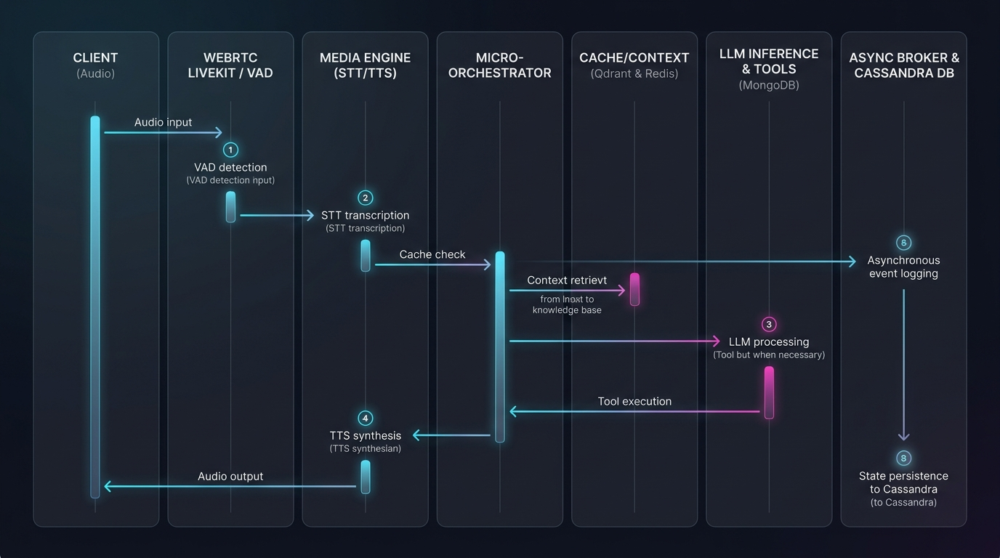

# Architectural Blueprint: Distributed Voice AI Banking Support Agent (V2)

A production-grade, low-latency, highly decoupled Voice AI banking agent built from first principles in Go. The architecture is optimized for sub-300ms interaction latencies, strict transaction safety, and horizontal scaling. It is built to satisfy the core capabilities expected of a Forward Deployed Engineering (FDE) team: bridging complex business requirements (real-time banking, compliance) with scalable distributed systems design.

---

## 🏗️ Architectural Evolution: V1 vs. V2

### Legacy Architecture (V1)
In V1, the system was comprised of only two main services: **`media-engine`** and **`llm-orchestrator`**.
* **The Problem**: Real-time voice interactions require extremely stable audio frame rendering. Under the legacy model, `llm-orchestrator` was a monolith executing database reads/writes (MongoDB), vector searches (Qdrant), session management, and external API requests synchronously on the request-response loop.
* **The Impact**: Slow write transactions (e.g., transfers, card blocking) or high-latency LLM generations introduced jitters, buffer delays, and packet drops in the WebRTC audio channel.

### Decoupled Microservices Architecture (V2)
To isolate heavy computing tasks (LLM inference, database writes, vector caching) from the WebRTC audio stream, the architecture was fully decoupled into **8 specialized microservices** coordinated asynchronously.

1. **`media-engine`**: High-performance WebRTC connection gateway interfacing with LiveKit. Handles real-time audio chunk streaming, Voice Activity Detection (VAD) endpointing, and coordinates TTS/STT pipelines.
2. **`llm-micro-orchestrator`**: A stateless, highly concurrent routing orchestrator managing intent routing, multi-turn state transitions, and template compilation.
3. **`session-context-service`**: Manages transient session state, parameters (slot-filling), and temporary conversation histories over Redis.
4. **`semantic-cache-service`**: Executes fast semantic vector probes in parallel with LLM inference to deflect queries and reclaim GPU/CPU cycles.
5. **`llm-inference-service`**: A standardized model-agnostic wrapper that executes local models (served via Ollama) and exposes slots to seamlessly plug in Cloud LLMs (e.g., Gemini, OpenAI) via environment variables with zero code changes.
6. **`tool-execution-service`**: Executes mutative ledger-level actions (MongoDB) and transactional validations.
7. **`conversation-history-consumer`**: An async worker draining Redis streams to persist conversation transcripts to Cassandra.
8. **`audit-log-consumer`**: An async worker draining Redis streams to persist security/transaction audits to Cassandra.

---

## 🎨 Architectural Design Diagrams

### 1. Basic Voice AI Flow
This shows the sequential block flow of a standard Voice AI turn: capturing user microphone input, transcribing to text, generating an agent response, synthesizing to audio speech, and playing it back.



### 2. High-Level Design (HDD)
This diagram illustrates the fully decoupled 8-service architecture. Nginx serves as the single WebSocket entry point, balancing traffic to media engine replicas, which talk to the stateless micro-orchestrator. Data writes, caching, and analytics are isolated across Redis, MongoDB, Qdrant, and Cassandra.



### 3. Low-Level Design & Data Flow Diagram (LLD / DFD)
This diagram details the sequence of operations and real-time data flow (DFD) for a single user utterance. Audio streaming, Speech-to-Text, parallel vector cache probes, LLM generation, tool validation, and Text-to-Speech synthesis execute in a low-latency pipeline, while transaction logging is offloaded asynchronously to Cassandra.



---

## ⚠️ Flaws of the Basic Flow in Banking (And How V2 Resolves Them)

While the **Basic Voice AI Flow** (`User -> STT -> LLM -> TTS -> User`) is a standard baseline for voice interaction, applying it directly to a production banking environment exposes several critical architectural and security flaws:

| Architectural Flaw in Basic Flow | Impact in Banking | V2 Resolution Mechanism |
| :--- | :--- | :--- |
| **No Authentication Gate** | Exposes private ledger data (balances, statements) without verification. | **Redis Session Intercept**: Every turn is validated against the `session-context-service`. Unauthenticated sessions are forced into an OTP/PIN sub-flow. |
| **Instant / Unconfirmed Writes** | User speech errors (e.g. misspelling names or amounts) trigger immediate, irreversible money transfers. | **2-Stage Write State Machine**: Mutative actions (transfers, card blocks) are staged in Redis as `StateAwaitingConfirmation`. They require positive user confirmation and a client-side idempotency token (`unique_ref_no`) before execution. |
| **Synchronous Database Writes** | Long-running database operations (MongoDB / Cassandra) block the audio loop, causing audio packet jitter and drops. | **Event Stream Offloading**: Write queries are decoupled. Transactions are verified in MongoDB, while analytical logs and transcripts are offloaded to Redis streams and consumed asynchronously by Cassandra workers. |
| **GPU Latency & Cost Spikes** | Simple or repetitive queries (greetings, ATM searches) hit the LLM, introducing high processing delays (>1.5s) and cost. | **Semantic Cache Deflection**: Orchestrator queries Qdrant vector store in parallel with speculative LLM inference. A hit $\ge 0.96$ similarity cancels the LLM thread and responds in <10ms. |
| **Prompt Injection & Scope Leaks** | Prompt injection attacks ("Ignore previous rules...") can leak internal system prompts or prompt malicious behavior. | **Regex Guardrails & Deflection**: Out-of-scope queries are blocked before LLM execution, returning static deflection responses directly. |

---

## ⚡ Core Technical Decisions & Optimizations

### 1. Multilingual Turn Supervisor
* **Unicode/Regex Language Classification**: The system intercepts the Speech-to-Text output and executes quick regex and Unicode character classification to detect Hindi/Hinglish vs. English.
* **Dynamic Template Swapping**: If Hindi/Hinglish is detected, the supervisor dynamically swaps system prompt templates, instructing the LLM to output in matching Hinglish. This maintains conversational comfort and natural flow without requiring translation middle-layers.

### 2. Semantic Caching & Load Shedding
* **Parallel Cache Probing**: When a transcribed utterance arrives, the `llm-micro-orchestrator` starts speculative LLM inference in the background while concurrently querying Qdrant for a semantic cache match.
* **Early Deflection**: If the Qdrant query returns a cache hit with a cosine similarity score $\ge 0.96$, the orchestrator immediately uses context cancellation to abort the pending LLM inference thread. This load-shedding mechanism immediately reclaims GPU cycles and delivers sub-10ms response latencies.

### 3. Transaction Safety & Saga Idempotency
* **2-Stage Write Confirmation**: Sensitive write operations (e.g., executing money transfers, blocking credit cards) require explicit user confirmation. The orchestrator transitions the session to `StateAwaitingConfirmation`.
* **Idempotent Token (`unique_ref_no`)**: When the user says "yes" to confirm, the client frontend attaches a client-side generated UUID (`unique_ref_no`).
* **Double-Charge Mitigation**: If the WebSocket drops and reconnects during the write execution, the retried transaction is matched against MongoDB's `unique_ref_no` index. The ledger returns the cached `payment_ref_no` instead of executing a duplicate charge.

---

## 🎙️ Hybrid STT / TTS Pipeline
Every deployment approach retains local model capabilities with cloud extension interfaces:

* **Speech-to-Text (STT)**: Uses Web Speech API on the client side with automatic watchdog recovery to handle silent Chrome browser drops.
* **Text-to-Speech (TTS)**: A hybrid pipeline utilizing **Kokoro-82M** (a local high-quality neural TTS model running natively with PyTorch Metal/MPS GPU acceleration on macOS), falling back to Google Translate TTS and native browser SpeechSynthesis.
* **Cloud Pluggability**: Standardized request schemas allow the `llm-inference-service` to dynamically route requests to external cloud model providers (like Gemini or OpenAI) by supplying their respective API keys in the environment config.

---

## 🚀 Operations & Deployment

### Directory & Component Layout
* **`cmd/`**: Entry points for the 8 decoupled microservices and the observability CLI.
* **`internal/`**: Core logic (orchestrator state machine, Cassandra/Mongo managers, telemetry, and MCP tools).
* **`native-kokoro/`**: Fast local neural TTS service setup.

### Getting Started
To boot the entire container stack, compile the Go binaries, and start the local services:
```bash
# Intelligent macOS arm64 bootstrapper (compiles binaries, provisions DBs, starts containers)
./start-app-v2.sh
```
* Once running, access the banking control panel at: **[http://localhost:9090](http://localhost:9090)**
* To cleanly terminate the stack:
```bash
./terminate.sh
```

### Port Layout
* **Public Gateway / Load Balancer**: Port `9090`
* **LiveKit WebRTC Server**: Port `7880`
* **Ollama (Local LLM server)**: Port `11434`
* **Qdrant Vector Database**: Port `6333`
* **MongoDB (Ledger)**: Port `27017`
* **Redis (Session Context)**: Port `6379`
* **Cassandra (Audit/History)**: Port `9042`
