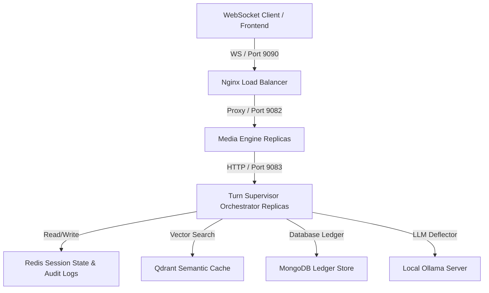

# Multilingual Voice AI Banking Support Agent (v2)

A production-grade, low-latency, multilingual Voice AI banking agent built in Go. It supports conversational state management (Turn Supervisor), slot-filling parameter collection, semantic caching, and strict transaction safety (using client reference numbers for de-duplication).

---

## 🏗️ Architecture Overview

The system runs a modular, containerized multi-service architecture scaled behind an Nginx load balancer to support high-throughput, low-latency voice interactions.



### Key Technical Specs:
*   **Edge Layer:** WebSocket connection edge server in Go (`cmd/media-engine`).
*   **Orchestration:** State machine,Turn Supervisor, and Hindi/Hinglish language detection (`cmd/llm-orchestrator-server`).
*   **Database & Cache:** MongoDB for transaction ledger, Qdrant for semantic caching, and Redis for Saga confirmation states & Audit logs.
*   **Deflector LLM:** Locally deployed `gemma2:2b` via Ollama for conversational fallback.

---

## ⚡ Core Features

1.  **Multilingual Turn Supervisor:** unicode-based language detection. If the user initiates a query or transaction in Hindi or Hinglish, the supervisor dynamically swaps language templates to respond in the user's input language.
2.  **Semantic Caching & Load Shedding:** Speculative Prefill (Ollama) and Cache Probe (Qdrant) run in parallel. A cache hit $\ge 0.96$ cosine similarity immediately halts LLM inference to reclaim GPU cycles.
3.  **Strict Transaction Safety:** 
    *   **`unique_ref_no` (Unique Reference Number):** Generated client-side on intent confirmation to prevent double-charging.
    *   **`payment_ref_no` (Payment Reference Number):** Returned on success by the ledger system and cached locally to handle network retries safely.

---

## 🚀 Getting Started

### Prerequisites
Make sure you have the following installed on your machine:
*   **Docker Desktop** (Active running daemon)
*   **Ollama** (Running locally on port `11434`)

### Setup & Launch
Simply execute the intelligent bootstrapper script. It checks system prerequisites, downloads required LLM models (`qwen2.5:7b-instruct` and `bge-m3`), compiles Go binaries, and launches the container stack:

```bash
./start-app-v2.sh
```

Once running, the script will automatically open the Control Panel dashboard in your browser:
🔗 **[http://localhost:9090](http://localhost:9090)**

To force a full rebuild and clean restart, run:
```bash
./start-app-v2.sh --force
```

### Teardown & Stop
To cleanly stop all container services and free up port assignments:

```bash
./terminate.sh
```

---

## ⚙️ Ports and Endpoint Layout

*   **Public Gateway (Dashboard / Websocket):** Port **`9090`**
*   **Media Engine Service (Internal):** Port **`9082`**
*   **LLM Orchestrator Server (Internal):** Port **`9083`**
*   **Qdrant Vector Database:** Port **`6333`**
*   **Redis Cache Server:** Port **`6379`**
*   **MongoDB Ledger database:** Port **`27017`**
