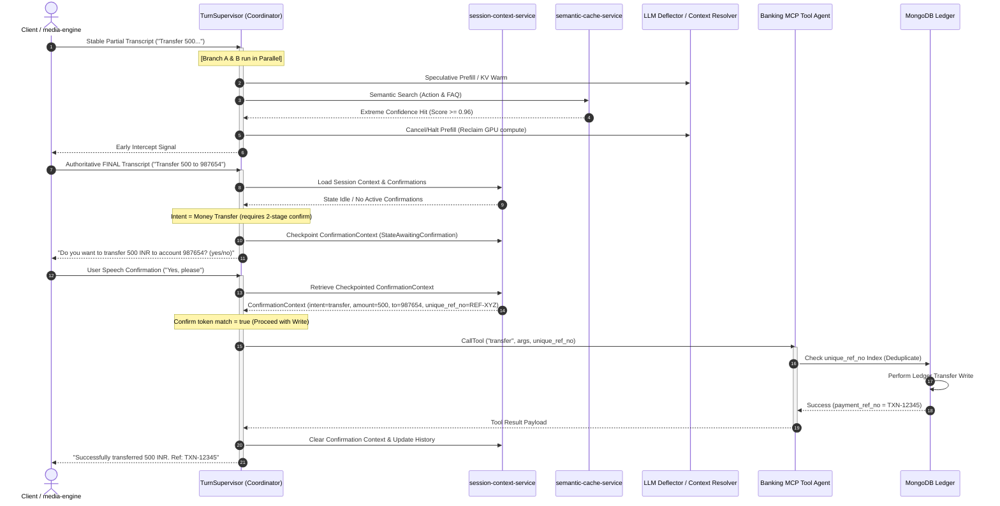

# Multi-Agent Architecture Blueprint: Distributed Voice AI Banking Support Agent (V2)

This document outlines the design, implementation, and interfaces of the multi-agent orchestration architecture built for the Voice AI banking support agent. To satisfy real-time latency targets (sub-300ms interaction) and strict transaction safety SLOs, the platform implements a decoupled, event-driven multi-agent system coordinated by a stateless supervisor.

---

## 🏗️ Multi-Agent Interaction Model

The Voice AI architecture transforms the standard, fragile sequential pipeline (`User -> STT -> LLM -> TTS -> User`) into a parallel, state-managed multi-agent execution flow. 

---

## 🤖 The Core Agents Catalog

The system is built around four specialized agent classes, each with bounded responsibilities, isolated compute scopes, and strict interface boundaries:

### 1. The Multilingual Turn Supervisor (The Coordinator Agent)
* **Role**: Orchestrates the lifecycle of a single voice turn. It coordinates the parallel speculative warming pipeline, handles early semantic cache interception, reconciles the final transcript, and determines prompt template selection.
* **Component Location**: Defined in [supervisor.go](file:///Users/dharmendra/golang-projects/banking-voice-ai-support-agent-v2/internal/llm-micro-orchestrator/supervisor.go) under the [TurnSupervisor](file:///Users/dharmendra/golang-projects/banking-voice-ai-support-agent-v2/internal/llm-micro-orchestrator/supervisor.go#L42) struct.
* **Key Capabilities**:
  * **Speculative Warming (Branch A)**: Prefills the user-independent static system prompts and conversation history into the LLM's KV cache (via [llm-inference-service](file:///Users/dharmendra/golang-projects/banking-voice-ai-support-agent-v2/cmd/llm-micro-orchestrator/main.go#L223)) as soon as the first stable partial Speech-to-Text (STT) tokens arrive.
  * **Mid-Flight Interception (Branch B)**: Concurrently embeds partial utterances and queries Qdrant for a semantic cache hit. If a match meets the `EXTREME` similarity threshold ($\ge 0.96$), it issues a context cancellation (`Cancel()`) to abort LLM prefilling, immediately reclaiming GPU cycles.
  * **Final Reconciliation & Dispatch**: At the end-of-utterance (authoritative final transcript), it verifies if the early halt decision remains valid against a `NORMAL` similarity threshold ($\ge 0.94$). If the user's completed statement diverged, it halts the intercept path and starts a cold LLM prefill fallback.
  * **Unicode/Regex Language classification**: The supervisor intercepts the STT output, executing character pattern classification. If Hindi or Hinglish is detected, it dynamically swaps system prompt templates to instruct the LLM to output in Hindi (using Devnagari characters) to preserve natural conversation.

### 2. The LLM Deflector & Context Resolver Agent
* **Role**: A contained, no-RAG prompt-instructed agent that manages conversational small talk, generates polite out-of-scope deflections, and resolves complex multi-turn linguistic references.
* **Component Location**: Wrapped inside the [Client](file:///Users/dharmendra/golang-projects/banking-voice-ai-support-agent-v2/internal/ollama/ollama.go#L18) struct in [ollama.go](file:///Users/dharmendra/golang-projects/banking-voice-ai-support-agent-v2/internal/ollama/ollama.go) and triggered by the [llm-inference-service](file:///Users/dharmendra/golang-projects/banking-voice-ai-support-agent-v2/cmd/llm-micro-orchestrator/main.go#L223).
* **Key Capabilities**:
  * **No Emojis or Markdown Constraints**: Generates plain, clean text stripped of markdown syntax (bolding, lists, asterisks) and emojis, which would otherwise be read aloud literally by the Text-to-Speech (TTS) synthesizer.
  * **Context Resolution (Follow-ups)**: Rather than answering questions about historical facts directly, it acts as a linguistic translator. It resolves queries like *"and last month's?"* in the context of transaction history, converting them into standalone queries (e.g. `get_transactions(n=10)`) which are re-dispatched to the deterministic action path.
  * **Out-of-Scope Deflection**: Under the strict system prompt [prompts.go](file:///Users/dharmendra/golang-projects/banking-voice-ai-support-agent-v2/internal/llm-micro-orchestrator/prompts.go#L5), general knowledge, product questions, or financial advice queries are rejected, politely offering handoff to a human representative.

### 3. The Banking MCP Agent (Tool Execution Service)
* **Role**: The gatekeeper of the core banking ledger (MongoDB). It exposes specific, safe read/write tools, validates identities, and guarantees transactional idempotency.
* **Component Location**: Defined under the [BankingMCPServer](file:///Users/dharmendra/golang-projects/banking-voice-ai-support-agent-v2/internal/mcp/banking_mcp.go#L16) struct in [banking_mcp.go](file:///Users/dharmendra/golang-projects/banking-voice-ai-support-agent-v2/internal/mcp/banking_mcp.go) and managed by [tool-execution-service](file:///Users/dharmendra/golang-projects/banking-voice-ai-support-agent-v2/internal/audit/audit_service.go#L37).
* **Exposed Tools**:
  * `get_balance`: Retrieves account balance.
  * `get_transactions`: Retrieves recent transactions.
  * `get_due_date`: Gets payment deadlines for debit/credit cards.
  * `block_card` [Write]: Blocks credit or debit cards.
  * `transfer` [Write/Money-Movement]: Executes funds transfer.
* **Key Capabilities**:
  * **2-Stage Write State Machine**: Any tool execution class marked as mutative (e.g. `transfer`, `block_card`) is intercepted during compliance checks. Instead of immediate execution, the session is moved to `StateAwaitingConfirmation`. The agent checkpoints the transaction details in Redis as a `ConfirmationContext` and asks the user for explicit confirmation. Only upon a verbal confirmation is the actual tool executed.
  * **Cryptographic Deduplication (`unique_ref_no`)**: In the event of a WebSocket drop or connection reset during a transaction, any retried request is matched against a unique MongoDB index of client-generated transaction references. The ledger returns the existing transaction response instead of executing a duplicate charge.

### 4. Background Compliance & Persistence Agents (Event-Driven Sinks)
* **Role**: Asynchronous consumer processes that subscribe to Redis event streams, extracting tracing contexts and writing transactional records to Cassandra for logging and audit purposes.
* **Component Location**: Defined in [consumer.go](file:///Users/dharmendra/golang-projects/banking-voice-ai-support-agent-v2/internal/llm-micro-orchestrator/consumer.go) and spawned as distinct services in [history-consumer](file:///Users/dharmendra/golang-projects/banking-voice-ai-support-agent-v2/cmd/conversation-history-consumer/main.go) and [audit-consumer](file:///Users/dharmendra/golang-projects/banking-voice-ai-support-agent-v2/cmd/audit-log-consumer/main.go).
* **Key Capabilities**:
  * **`conversation-history-consumer`**: Consumes from the `conversation_history_stream` stream to write anonymized turn transcripts and metadata asynchronously to Cassandra, preventing write-latency from blocking the active voice websocket channel.
  * **`audit-log-consumer`**: Consumes from the `audit_log_stream` stream, extracting W3C `traceparent` contexts and logging security tool call logs for strict audit tracking.

---

## 🔒 Security, Compliance & Safety Guardrails

The architecture implements a defense-in-depth model to enforce safety boundaries around the LLM, preventing prompt injections and transaction hallucinations:

### 1. Trusted-Source Rule
The LLM Deflector Agent has no direct connection to core data and is never used as a source of truth for bank details. Information can only be presented to the customer if it was:
1. Returned directly from a verified Banking MCP tool call.
2. Retrieved from a curated FAQ index point within the Qdrant database.

### 2. Output Guardrail Filter (Backstop)
Before any text is sent to the TTS pipeline, the Turn Supervisor applies the [ApplyOutputGuardrailFilter](file:///Users/dharmendra/golang-projects/banking-voice-ai-support-agent-v2/internal/llm-micro-orchestrator/supervisor.go#L439) method. This filter verifies that any numbers, amounts, dates, or card configurations in the generated response correspond to values in the conversation history or tool response. Any ungrounded numbers are suppressed, and the session is immediately escalated to a human.

### 3. Session Context & PII Redaction
The [ContextManager](file:///Users/dharmendra/golang-projects/banking-voice-ai-support-agent-v2/internal/contextmanager/manager.go#L20) implements two critical security controls:
* **Sliding Window Pruning**: Restricts LLM context memory to the last 5 turns to prevent context length inflation and scope drift.
* **PII Redaction**: Regular expressions strip credit/debit card numbers, CVVs, and PINs from user prompts before they are saved to Redis context stores or passed to inference endpoints.

---

## 📂 Codebase Directory Index & Agent Navigation Map

To enable autonomous coding agents to navigate this project instantly, the table below maps every microservice, client library, database manager, and telemetry subsystem to its exact codebase location:

### 1. Microservice Entry Points (`cmd/`)
Each service runs inside its isolated container and is defined in the `cmd` namespace:
* **media-engine**: [main.go](file:///Users/dharmendra/golang-projects/banking-voice-ai-support-agent-v2/cmd/media-engine/main.go) handles inbound client voice streams (WebSockets) and relays voice payloads.
* **llm-micro-orchestrator**: [main.go](file:///Users/dharmendra/golang-projects/banking-voice-ai-support-agent-v2/cmd/llm-micro-orchestrator/main.go) is the core HTTP server coordinating state routing.
* **session-context-service**: [main.go](file:///Users/dharmendra/golang-projects/banking-voice-ai-support-agent-v2/cmd/session-context-service/main.go) operates the transient Redis conversation history keys.
* **semantic-cache-service**: [main.go](file:///Users/dharmendra/golang-projects/banking-voice-ai-support-agent-v2/cmd/semantic-cache-service/main.go) runs vector queries against Qdrant.
* **llm-inference-service**: [main.go](file:///Users/dharmendra/golang-projects/banking-voice-ai-support-agent-v2/cmd/llm-inference-service/main.go) acts as the model-agnostic inference proxy.
* **tool-execution-service**: [main.go](file:///Users/dharmendra/golang-projects/banking-voice-ai-support-agent-v2/cmd/tool-execution-service/main.go) handles MongoDB ledger updates.
* **conversation-history-consumer**: [main.go](file:///Users/dharmendra/golang-projects/banking-voice-ai-support-agent-v2/cmd/conversation-history-consumer/main.go) reads Redis streams and writes transcript blocks to Cassandra.
* **audit-log-consumer**: [main.go](file:///Users/dharmendra/golang-projects/banking-voice-ai-support-agent-v2/cmd/audit-log-consumer/main.go) processes and sinks security event audits.
* **observability-cli**: [main.go](file:///Users/dharmendra/golang-projects/banking-voice-ai-support-agent-v2/cmd/observability-cli/main.go) queries Redis streams to report performance audit telemetry.

### 2. Core Library Implementation (`internal/`)
Encapsulates reusable utilities, middleware wrappers, and orchestration engines:
* **llm-micro-orchestrator**:
  * [supervisor.go](file:///Users/dharmendra/golang-projects/banking-voice-ai-support-agent-v2/internal/llm-micro-orchestrator/supervisor.go) contains the core [TurnSupervisor](file:///Users/dharmendra/golang-projects/banking-voice-ai-support-agent-v2/internal/llm-micro-orchestrator/supervisor.go#L42) state machine.
  * [prompts.go](file:///Users/dharmendra/golang-projects/banking-voice-ai-support-agent-v2/internal/llm-micro-orchestrator/prompts.go) defines system prompt templates and character instructions.
  * [consumer.go](file:///Users/dharmendra/golang-projects/banking-voice-ai-support-agent-v2/internal/llm-micro-orchestrator/consumer.go) runs stream loop handlers for Cassandra async logging.
* **mcp**: [banking_mcp.go](file:///Users/dharmendra/golang-projects/banking-voice-ai-support-agent-v2/internal/mcp/banking_mcp.go) contains the tool routing for [BankingMCPServer](file:///Users/dharmendra/golang-projects/banking-voice-ai-support-agent-v2/internal/mcp/banking_mcp.go#L16).
* **contextmanager**: [manager.go](file:///Users/dharmendra/golang-projects/banking-voice-ai-support-agent-v2/internal/contextmanager/manager.go) manages conversation history pruning and PII redaction.
* **audit**: [audit_service.go](file:///Users/dharmendra/golang-projects/banking-voice-ai-support-agent-v2/internal/audit/audit_service.go) executes structural validation and logging.
* **ollama**: [ollama.go](file:///Users/dharmendra/golang-projects/banking-voice-ai-support-agent-v2/internal/ollama/ollama.go) is the client wrapper connecting to the inference engine.
* **telemetry**:
  * [telemetry.go](file:///Users/dharmendra/golang-projects/banking-voice-ai-support-agent-v2/internal/telemetry/telemetry.go) setups OpenTelemetry tracing spans.
  * [structured_logger.go](file:///Users/dharmendra/golang-projects/banking-voice-ai-support-agent-v2/internal/telemetry/structured_logger.go) handles JSON-structured telemetry logging.

### 3. Database Clients & Infrastructure Integration (`internal/db/`)
* **redis.go**: [redis.go](file:///Users/dharmendra/golang-projects/banking-voice-ai-support-agent-v2/internal/db/redis.go) wraps the session context database.
* **qdrant.go**: [qdrant.go](file:///Users/dharmendra/golang-projects/banking-voice-ai-support-agent-v2/internal/db/qdrant.go) hosts vector searches for cache matching.
* **mongo.go**: [mongo.go](file:///Users/dharmendra/golang-projects/banking-voice-ai-support-agent-v2/internal/db/mongo.go) runs transactional queries against the account ledger.
* **cassandra.go**: [cassandra.go](file:///Users/dharmendra/golang-projects/banking-voice-ai-support-agent-v2/internal/db/cassandra.go) handles long-term compliance storage.

---

## 📊 Telemetry and Real-Time Performance Audits

All interactions between agents are instrumented with OpenTelemetry tracing spans:
* Internal calls (from the orchestrator to Qdrant, Redis, or the MCP Server) carry W3C `traceparent` headers.
* The [observability-cli](file:///Users/dharmendra/golang-projects/banking-voice-ai-support-agent-v2/cmd/observability-cli/main.go) reads these streams to calculate core performance metrics:

$$\text{Cache Hit Rate} = \left( \frac{\text{Action Matches} + \text{FAQ Matches}}{\text{Total Dialog Turns}} \right) \times 100$$

$$\text{Wasted Prefill Ratio} = \left( \frac{\text{Prefill Tokens Spent on Cache Hits}}{\text{Total Prefill Tokens Spent}} \right) \times 100$$

$$\text{Early-Halt Precision} = \left( \frac{\text{Successful Intercepts without Divergence}}{\text{Halt Points Triggered}} \right) \times 100$$

These metrics let engineering teams tune the `EXTREME` and `NORMAL` thresholds dynamically to achieve the best trade-off between latency savings and GPU compute consumption.
