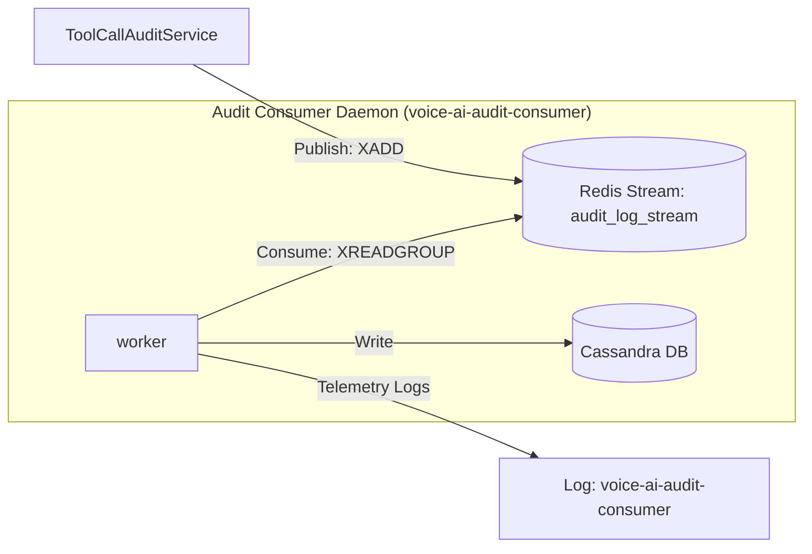

# Decoupled Audit Log Consumer Plan

This plan details the architecture for the **Audit Log Consumer** (`"voice-ai-audit-consumer"`). It reads tool execution and security compliance logs from the `audit_log_stream` Redis Stream, writes them to Cassandra for a durable compliance audit trail, and exposes a pull-based `/healthz` HTTP endpoint.

---

## 1. Architectural Architecture Flow



---

## 2. Telemetry and APM Registration

Under this setup, the consumer daemon will run under its own dedicated APM/logging boundary:
* **Service Name**: `voice-ai-audit-consumer`
* **Parent Namespace**: `voice-ai-agent` (allowing unified end-to-end trace correlation)

---

## 3. Implementation Details

### A. The Producer: Publishing to Redis Stream
The existing `ToolCallAuditService` inside `internal/audit/audit_service.go` publishes events to `audit_log_stream`. We will inject the standard W3C `"traceparent"` string into the event metadata so the consumer can reconstruct the trace context:

```go
// Get traceparent from context using standard OpenTelemetry propagator
var tpMap = make(map[string]string)
otel.GetTextMapPropagator().Inject(ctx, propagation.MapCarrier(tpMap))
traceParent := tpMap["traceparent"]

event := map[string]interface{}{
    "timestamp":    time.Now().Format(time.RFC3339),
    "turn_id":      turnID,
    "session_id":   sessionID,
    "user_id":      userID,
    "action":       toolName,
    "args":         string(argsBytes),
    "result":       result,
    "traceparent":  traceParent, // Inject trace context for async correlation
}

err := s.Redis.Client.XAdd(ctx, &redis.XAddArgs{
    Stream: "audit_log_stream",
    Values: event,
}).Err()
```

---

### B. The Consumer: Reading and Sinking to Cassandra
The consumer daemon runs as a background process. It extracts the `"traceparent"` from the message, recreates the trace context, and starts its write span as a linked or child span of the original transaction trace.

**Go Code Template**:
```go
func StartAuditConsumer(ctx context.Context, r *db.RedisManager, c *db.CassandraManager) {
    logger := telemetry.Logger("voice-ai-audit-consumer")
    stream := "audit_log_stream"
    group := "cassandra_audit_group"
    consumer := "consumer-node-1"

    // Initialize group if not exists
    _ = r.Client.XGroupCreateMkStream(ctx, stream, group, "$").Err()

    go func() {
        for {
            select {
            case <-ctx.Done():
                return
            default:
                entries, err := r.Client.XReadGroup(ctx, &redis.XReadGroupArgs{
                    Group:    group,
                    Consumer: consumer,
                    Streams:  []string{stream, ">"},
                    Count:    10,
                    Block:    2 * time.Second,
                }).Result()

                if err != nil {
                    continue
                }

                for _, streamEntry := range entries {
                    for _, msg := range streamEntry.Messages {
                        start := time.Now()
                        
                        // 1. Unpack values
                        turnID, _ := msg.Values["turn_id"].(string)
                        sessionID, _ := msg.Values["session_id"].(string)
                        userID, _ := msg.Values["user_id"].(string)
                        action, _ := msg.Values["action"].(string)
                        args, _ := msg.Values["args"].(string)
                        result, _ := msg.Values["result"].(string)
                        traceParent, _ := msg.Values["traceparent"].(string)

                        // 2. Extract Context from traceparent
                        var tpCtx = context.Background()
                        if traceParent != "" {
                            tpCtx = otel.GetTextMapPropagator().Extract(tpCtx, propagation.MapCarrier{"traceparent": traceParent})
                        }

                        // 3. Start OTel span for async database write
                        spanCtx, span := otel.Tracer("audit-consumer").Start(tpCtx, "cassandra.write_audit")

                        // 4. Write to Cassandra Audit table
                        writeErr := c.LogAuditEvent(spanCtx, userID, sessionID, turnID, action, args, result)
                        span.End()

                        duration := time.Since(start)
                        durationMS := float64(duration.Nanoseconds()) / 1e6

                        logRecord := telemetry.StructuredLog{
                            Timestamp:           time.Now(),
                            Level:               "INFO",
                            Logger:              "voice-ai-audit-consumer",
                            Message:             "Processed audit log write to Cassandra",
                            Duration:            duration.String(),
                            DurationMS:          durationMS,
                            SessionID:           sessionID,
                            TurnID:              turnID,
                            DBSystem:            "cassandra",
                            DBCollection:        "audit_logs",
                            DBOperation:         "insert",
                        }

                        if writeErr != nil {
                            logRecord.Level = "ERROR"
                            logRecord.Message = fmt.Sprintf("Failed to write audit to Cassandra: %v", writeErr)
                            logger.ErrorContext(spanCtx, "audit_write_failed", slog.Any("details", logRecord))
                        } else {
                            // Acknowledge the message in Redis Stream
                            r.Client.XAck(ctx, stream, group, msg.ID)
                            logger.InfoContext(spanCtx, "audit_write_success", logRecord.SlogArgs()...)
                        }
                    }
                }
            }
        }
    }()
}
```

---

### C. The Consumer Health Check HTTP Endpoint (`/healthz`)
Exposes an HTTP server on a dedicated port (e.g., `9086`) with a `/healthz` endpoint. It dynamically checks Redis connectivity, Cassandra connectivity, and the consumer group backlog lag:

**Go HTTP Handler Code**:
```go
type AuditHealthStatus struct {
	Status     string            `json:"status"`
	Redis      string            `json:"redis"`
	Cassandra  string            `json:"cassandra"`
	PendingLag int64             `json:"pending_lag"`
	Error      string            `json:"error,omitempty"`
}

func handleAuditConsumerHealth(w http.ResponseWriter, r *http.Request, redisClient *redis.Client, cassandraSession *gocql.Session) {
	w.Header().Set("Content-Type", "application/json")
	status := AuditHealthStatus{
		Status: "healthy",
		Redis:  "up",
		Cassandra: "up",
	}
	hasError := false

	// 1. Check Redis Connection
	if err := redisClient.Ping(r.Context()).Err(); err != nil {
		status.Redis = "down"
		status.Status = "unhealthy"
		status.Error = "Redis ping failed: " + err.Error()
		hasError = true
	}

	// 2. Check Cassandra Connection
	if cassandraSession == nil || cassandraSession.Closed() {
		status.Cassandra = "down"
		status.Status = "unhealthy"
		status.Error = "Cassandra session is closed or nil"
		hasError = true
	}

	// 3. Check Redis Stream Pending Backlog (Lag)
	if !hasError {
		pending, err := redisClient.XPending(r.Context(), "audit_log_stream", "cassandra_audit_group").Result()
		if err != nil {
			status.Status = "unhealthy"
			status.Error = "Failed to query Redis stream backlog: " + err.Error()
			hasError = true
		} else {
			status.PendingLag = pending.Count
			// If message backlog is too high, mark as degraded or unhealthy
			if pending.Count > 100 {
				status.Status = "degraded"
				status.Error = fmt.Sprintf("High backlog lag: %d unacknowledged messages", pending.Count)
				w.WriteHeader(http.StatusServiceUnavailable)
				_ = json.NewEncoder(w).Encode(status)
				return
			}
		}
	}

	if hasError {
		w.WriteHeader(http.StatusServiceUnavailable)
	} else {
		w.WriteHeader(http.StatusOK)
	}
	_ = json.NewEncoder(w).Encode(status)
}
```
