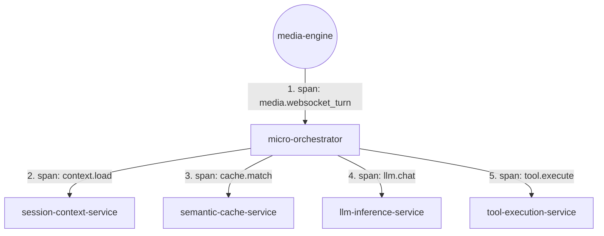

# APM & Logging Plan for Decoupled Services

This plan details the OpenTelemetry spans, metrics, log events, and custom attributes that each of the decoupled services will report.

---

## 1. Trace Propagation Topology

Every service propagates the trace context down the chain to allow unified end-to-end request tracing:



---

## 2. Telemetry Specifications per Service

### A. `micro-orchestrator` (Service Name: `micro-orchestrator`)
This service acts as the root span initiator for the backend processing tree.

* **Primary Spans**:
  * `orchestration.turn`: Spans the entire lifecycle of a customer transaction/turn.
* **Attributes**:
  * `session_id` (string): Identifies the call session.
  * `turn_id` (string): Unique identifier for the dialog exchange.
  * `orchestration.path` (string): Path chosen (`"cached_faq"`, `"llm_chat"`, `"tool_execution"`).
* **Logs & Metrics**:
  * Logs the start of the turn with the incoming user transcript.
  * Emits turn outcome stats and final end-to-end orchestrator processing latency.

---

### B. `session-context-service` (Service Name: `session-context-service`)
Responsible for active memory operations.

* **Primary Spans**:
  * `context.load`: Span tracking reading from Redis.
  * `context.save`: Span tracking updating the active session context.
  * `context.prune`: Span tracking sliding window context truncation (max 5 turns).
* **Attributes**:
  * `context.memory_size_bytes` (int): Active session byte size.
  * `context.pruned_turns` (int): Number of dialog turns removed during sliding window pruning.
* **Logs & Metrics**:
  * Logs warnings if a session context is close to expiry (Redis TTL).
  * Emits metrics for Redis read/write latency.

---

### C. `semantic-cache-service` (Service Name: `semantic-cache-service`)
Evaluates queries against FAQ and intent vectors.

* **Primary Spans**:
  * `cache.match`: Span tracking Qdrant FAQ searches and score evaluations.
* **Attributes**:
  * `qdrant.collection` (string): Vector database collection queried (e.g. `faqs`).
  * `qdrant.threshold` (float): Minimum similarity threshold required.
  * `qdrant.score` (float): Match similarity score returned.
  * `cache.outcome` (string): Result of the lookup (`"hit"` or `"miss"`).
* **Logs & Metrics**:
  * Logs matching vector intents and responses for hits.
  * Emits custom gauge metrics for cache hit-to-miss ratios.

---

### D. `llm-inference-service` (Service Name: `llm-inference-service`)
Manages model calls and token outputs.

* **Primary Spans**:
  * `llm.chat`: Span tracking the Ollama inference duration.
  * `llm.embedding`: Span tracking vector representation generation.
* **Attributes**:
  * `llm.model` (string): The active model name (e.g. `gemma4:e4b`).
  * `llm.temperature` (float): Sampling temperature.
  * `llm.prompt_tokens` (int): Input prompt token count.
  * `llm.completion_tokens` (int): Output generated token count.
  * `llm.time_to_first_token_ms` (float): Time elapsed until first token returned.
* **Logs & Metrics**:
  * Logs Time-To-First-Token (TTFT) metrics for streaming latency calculations.
  * Logs warning alerts if local Ollama fails and the service falls back to backup cloud APIs.

---

### E. `tool-execution-service` (Service Name: `tool-execution-service`)
Executes database read/writes and compliance overrides.

* **Primary Spans**:
  * `tool.execute`: Span tracking the execution of the selected MCP tool.
  * `tool.compliance_check`: Span tracking compliance/identity checks.
* **Attributes**:
  * `mcp.tool` (string): Name of the called MCP tool (e.g. `get_balance`, `transfer`).
  * `db.system` (string): Target database (e.g. `mongodb`).
  * `db.collection` (string): Target DB collection.
  * `db.operation` (string): Action type (`"find"`, `"update"`, etc.).
  * `security.compliance_action` (string): Decision made (`"allow"`, `"confirm_required"`, `"block"`).
* **Logs & Metrics**:
  * Logs audit details of account reads/writes.
  * Logs security warning blocks if authentication injection mismatch is detected.

---

## 3. SQL ClickHouse Query Templates

Under this structure, you can inspect trace performance across the entire microservice chain using ClickHouse:

### Query: Track latency breakdown of every component inside a turn
```sql
SELECT 
    fromUnixTimestamp64Nano(timestamp) AS time,
    service_name, -- micro-orchestrator, session-context-service, semantic-cache-service, etc.
    span_name,    -- orchestration.turn, context.load, cache.match, llm.chat, tool.execute
    attributes_float['duration_ms'] AS component_latency_ms,
    attributes_string['cache.outcome'] AS cache_hit_miss,
    attributes_string['llm.model'] AS model_used
FROM signoz_logs.distributed_logs_v2
WHERE resource_string['service.namespace'] = 'voice-ai-agent'
  AND attributes_string['session_id'] = 'session-abc-123'
ORDER BY timestamp ASC;
```
