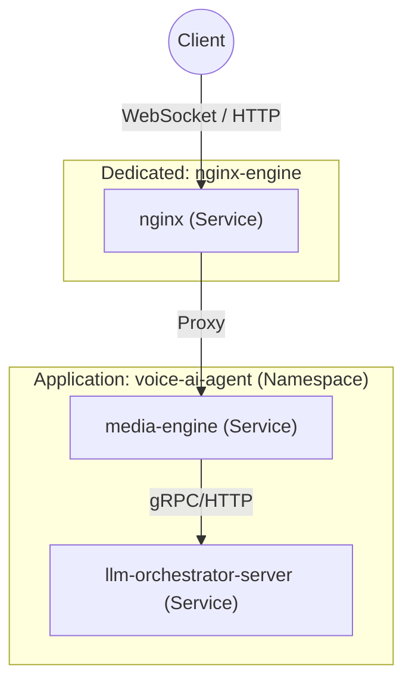

# Telemetry & APM Architecture Plan: "voice-ai-agent" & "nginx-engine"

This plan outlines how our logging and APM telemetry will be structured to allow both **consolidated (end-to-end)** and **individual (per-service)** observability.

---

## 1. The Core Strategy: OpenTelemetry Resource Conventions

To satisfy the requirement where Go services report individually but belong to a single parent system, we utilize OpenTelemetry standard resource attributes:
* **`service.name`**: Identifies the individual running microservice (e.g. `media-engine`, `llm-orchestrator-server`).
* **`service.namespace`**: Represents the unified parent application / end-to-end system namespace (`voice-ai-agent`).
* **`nginx-engine`**: Nginx runs as its own separate entity, reporting metrics and logs under its own dedicated service namespace.

### The Service Map Hierarchy



---

## 2. Configuration Implementations

### A. Go Services Telemetry Configuration (`telemetry.go`)
We inject the namespace attribute into the OTel Resource initialization inside the `telemetry` package:

```go
res, _ := resource.New(ctx, resource.WithAttributes(
    attribute.String("service.name", serviceName),               // e.g. "media-engine"
    attribute.String("service.namespace", "voice-ai-agent"),     // Unified parent name
))
```

### B. Nginx Telemetry Configuration (`nginx-engine`)
Nginx will be configured to output its logs and metrics under a dedicated service name.

1. **Docker Container Tagging (Log Collector)**:
   In our logging daemon/collector (e.g. Vector, fluent-bit, or OTel collector), container logs from the `voice_agent_lb_v2` service are automatically enriched with:
   * `service.name = "nginx-engine"`
   * `service.namespace = "nginx-engine"`

2. **Nginx OpenTelemetry Module (APM)**:
   If Nginx APM tracing is enabled using the `otel` module in `nginx.conf`, the directive is configured as:
   ```nginx
   otel_service_name nginx-engine;
   otel_exporter {
       endpoint host.docker.internal:4317;
   }
   ```

---

## 3. How Logs & APM Will Look

### A. In SigNoz / APM UI

* **Consolidated Service List**:
  SigNoz will display services grouped by namespace. Under the **`voice-ai-agent`** namespace, you will see a service map showing:
  `media-engine` $\rightarrow$ `llm-orchestrator-server`.
* **External Gateway**:
  You will see a separate, dedicated entry for **`nginx-engine`** showing incoming traffic rates, network bandwidth, response latency, and any upstream connection error rates.

### B. ClickHouse Log Queries

When searching logs, you no longer need complex queries. You can query the whole system end-to-end using the namespace, or isolate a single service.

#### Query 1: Retrieve all logs across the entire Voice AI system (End-to-End)
```sql
SELECT 
    fromUnixTimestamp64Nano(timestamp) AS time,
    service_name, -- e.g. media-engine or llm-orchestrator-server
    body AS message,
    attributes_float['duration_ms'] AS duration_ms,
    attributes_string['session_id'] AS session_id
FROM signoz_logs.distributed_logs_v2
WHERE resource_string['service.namespace'] = 'voice-ai-agent' -- Unified system filter
  AND attributes_string['session_id'] = 'session-abc-123'     -- Specific user call
ORDER BY timestamp DESC
LIMIT 100
```

#### Query 2: Retrieve logs for a specific service individually
```sql
SELECT 
    fromUnixTimestamp64Nano(timestamp) AS time,
    body AS message,
    attributes_float['duration_ms'] AS duration_ms
FROM signoz_logs.distributed_logs_v2
WHERE service_name = 'media-engine' -- Individual service filter
ORDER BY timestamp DESC
LIMIT 50
```

#### Query 3: Check dedicated Load Balancer routing failures / timeouts
```sql
SELECT 
    fromUnixTimestamp64Nano(timestamp) AS time,
    body AS nginx_log_line
FROM signoz_logs.distributed_logs_v2
WHERE service_name = 'nginx-engine' -- Dedicated LB logs
  AND (position(body, 'error') > 0 OR position(body, '502') > 0)
ORDER BY timestamp DESC
LIMIT 50
```
