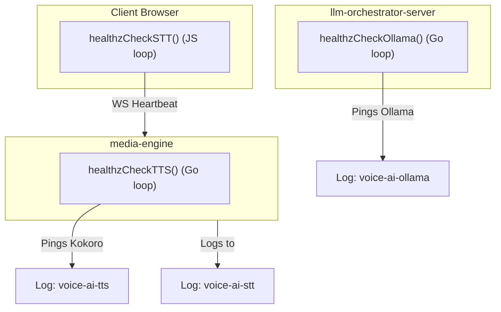

# Background Model & Service Health Check Plan

This plan details how we will implement background checking for STT, TTS, and Ollama, routing their logs and APM to dedicated observability services: `"voice-ai-stt"`, `"voice-ai-tts"`, and `"voice-ai-ollama"`.

---

## 1. Architecture Flow



---

## 2. Implementation Specs

### A. Ollama Health Checker (`healthzCheckOllama()`)
Runs as a background goroutine in the `llm-orchestrator-server`. It pings Ollama every 15 seconds, records ping latency, and logs to a dedicated logger `"voice-ai-ollama"`.

**Go Code Template**:
```go
func StartOllamaHealthCheck(ctx context.Context, ollamaURL string) {
    logger := telemetry.Logger("voice-ai-ollama")
    client := &http.Client{Timeout: 5 * time.Second}
    ticker := time.NewTicker(15 * time.Second)

    go func() {
        for {
            select {
            case <-ctx.Done():
                return
            case <-ticker.C:
                start := time.Now()
                resp, err := client.Get(ollamaURL + "/")
                duration := time.Since(start)
                durationMS := float64(duration.Nanoseconds()) / 1e6

                logRecord := telemetry.StructuredLog{
                    Timestamp:  time.Now(),
                    Level:      "INFO",
                    Logger:     "voice-ai-ollama",
                    Duration:   duration.String(),
                    DurationMS: durationMS,
                }

                if err != nil || resp.StatusCode != http.StatusOK {
                    logRecord.Level = "ERROR"
                    logRecord.Message = "Ollama connection failed"
                    logger.ErrorContext(ctx, "health_check", slog.Any("details", logRecord))
                } else {
                    resp.Body.Close()
                    logRecord.Message = "Ollama is healthy"
                    logger.InfoContext(ctx, "health_check", logRecord.SlogArgs()...)
                }
            }
        }
    }()
}
```

---

### B. TTS Health Checker (`healthzCheckTTS()`)
Runs as a background goroutine in `media-engine`. It pings the Kokoro TTS `/docs` endpoint every 15 seconds, records latency, and logs to `"voice-ai-tts"`.

**Go Code Template**:
```go
func StartTTSHealthCheck(ctx context.Context, ttsURL string) {
    logger := telemetry.Logger("voice-ai-tts")
    client := &http.Client{Timeout: 5 * time.Second}
    ticker := time.NewTicker(15 * time.Second)

    go func() {
        for {
            select {
            case <-ctx.Done():
                return
            case <-ticker.C:
                start := time.Now()
                resp, err := client.Get(ttsURL + "/v1/audio/speech") // Or GET /docs
                duration := time.Since(start)
                durationMS := float64(duration.Nanoseconds()) / 1e6

                logRecord := telemetry.StructuredLog{
                    Timestamp:  time.Now(),
                    Level:      "INFO",
                    Logger:     "voice-ai-tts",
                    Duration:   duration.String(),
                    DurationMS: durationMS,
                }

                // Kokoro GET /docs returns 200, GET /v1/audio/speech without body returns 405 (which means server is alive)
                if err != nil || (resp.StatusCode != http.StatusOK && resp.StatusCode != http.StatusMethodNotAllowed) {
                    logRecord.Level = "ERROR"
                    logRecord.Message = "Kokoro TTS service unhealthy"
                    logger.ErrorContext(ctx, "health_check", slog.Any("details", logRecord))
                } else {
                    resp.Body.Close()
                    logRecord.Message = "Kokoro TTS is healthy"
                    logger.InfoContext(ctx, "health_check", logRecord.SlogArgs()...)
                }
            }
        }
    }()
}
```

---

### C. STT Health Checker (`healthzCheckSTT()`)
Implemented in browser JavaScript. The client checks every 15 seconds if the Web Speech Recognition instance is initialized and active. It sends a heartbeat message over the WebSocket to the `media-engine`.

**Javascript Code Template (`frontend/index.html`)**:
```javascript
function startSTTHealthCheck(ws) {
    setInterval(() => {
        const isSupported = !!(window.SpeechRecognition || window.webkitSpeechRecognition);
        const isListening = recognitionActive; // Boolean flag tracking mic listening state

        ws.send(JSON.stringify({
            type: "client_log",
            payload: {
                level: isSupported ? "info" : "error",
                event: "stt_health_heartbeat",
                message: JSON.stringify({
                    supported: isSupported,
                    active: isListening,
                    timestamp: new Date().toISOString()
                })
            }
        }));
    }, 15000);
}
```

**Go WebSocket Handler modification (`media-engine/main.go`)**:
We will intercept the `stt_health_heartbeat` event and log it directly under the `"voice-ai-stt"` logger:
```go
case "client_log":
    payload, ok := msg.Payload.(map[string]any)
    if ok {
        event, _ := payload["event"].(string)
        message, _ := payload["message"].(string)

        if event == "stt_health_heartbeat" {
            sttLogger := telemetry.Logger("voice-ai-stt")
            // Parse message details and log as top-level OTel attributes
            sttLogger.InfoContext(r.Context(), "stt_heartbeat", "message", message)
        }
    }
```

---

## 3. How Logs and APM Will Present

In ClickHouse, you will be able to query the historical uptime, health status, and response latency of all three model dependencies:

```sql
-- Query Ollama Latency and Availability over time
SELECT 
    fromUnixTimestamp64Nano(timestamp) AS time,
    body AS status_message,
    attributes_float['duration_ms'] AS ping_latency_ms
FROM signoz_logs.distributed_logs_v2
WHERE service_name = 'voice-ai-ollama'
ORDER BY timestamp DESC
LIMIT 50;

-- Query Kokoro TTS Latency and Availability over time
SELECT 
    fromUnixTimestamp64Nano(timestamp) AS time,
    body AS status_message,
    attributes_float['duration_ms'] AS ping_latency_ms
FROM signoz_logs.distributed_logs_v2
WHERE service_name = 'voice-ai-tts'
ORDER BY timestamp DESC;
```
