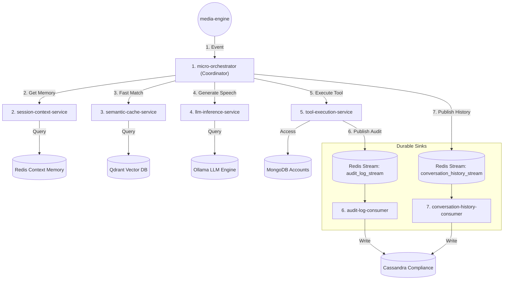

# Fully Decoupled Orchestrator Microservice Architecture

This plan represents the fully decoupled, production-grade microservice architecture for the Voice AI Agent platform. Every component is split into a single-purpose service.

---

## 1. Architectural Architecture Flow (8 Services)

---

## 2. Service Definition & Responsibility Grid

| # | Service Name | Responsibility | Tech Stack | Scaled By |
| :--- | :--- | :--- | :--- | :--- |
| **1** | **`micro-orchestrator`** | **Stateless Coordinator**: Receives incoming transcripts, queries context, coordinates caching/tool calls, streams results back. | Go | Incoming call throughput |
| **2** | **`session-context-service`** | **Memory Master**: Manages session history state, performs sliding-window pruning (max 5 turns), and redacts sensitive PII. | Go + Redis | Active session count |
| **3** | **`semantic-cache-service`** | **Fast Cache Router**: Matches incoming user queries against Qdrant vector FAQs and action intents. | Go + Qdrant | Chat token rate |
| **4** | **`llm-inference-service`** | **LLM Gateway**: Manages token streaming, prompts injection, rate-limiting, and model fallback (e.g. Ollama $\rightarrow$ Backup Cloud API). | Go or Python | Token generation volume |
| **5** | **`tool-execution-service`** | **Security & Tool Executor**: Evaluates transactional compliance (write validations), injects session identity, and executes read-only MCP queries. | Go + MongoDB | Transaction call volume |
| **6** | **`conversation-history-consumer`**| **Transcripts Sink**: Background consumer writing turn records asynchronously to Cassandra. | Go + Cassandra | Cassandra write speed |
| **7** | **`audit-log-consumer`** | **Compliance Sink**: Background consumer writing tool audits asynchronously to Cassandra. | Go + Cassandra | Compliance audit volume |
| **8** | **`media-engine`** | **Network Boundary**: Handles WebSocket user sockets, audio encoding/decoding, and client-side heartbeat logs. | Go + WebSockets | Socket connections |

---

## 3. Why This Complete Decoupling is Necessary

### A. Context Isolation from LLM Latency
If the LLM engine (`Ollama`) is busy or experiences resource exhaustion, the **`session-context-service`** is completely unaffected. The user's active session history stays intact in memory, and the system can handle state retrieval and updates without waiting for LLM thread queues.

### B. Dynamic Model Swapping (`llm-inference-service`)
By wrapping the LLM calls in a dedicated `llm-inference-service`, the orchestrator has zero knowledge of the actual underlying model provider. You can switch from local **Ollama (Gemma)** to **Gemini API** or **OpenAI** dynamically via config changes in the `llm-inference-service`, without redeploying the orchestrator or changing how tools are handled.

### C. Stateless Orchestration
Because the `micro-orchestrator` is now completely **stateless**, it has no local database connections, no caching connections, and no heavy LLM libraries. If it crashes, it can be instantly restarted and can serve any user session immediately (as context is loaded on-demand from the `session-context-service`).
