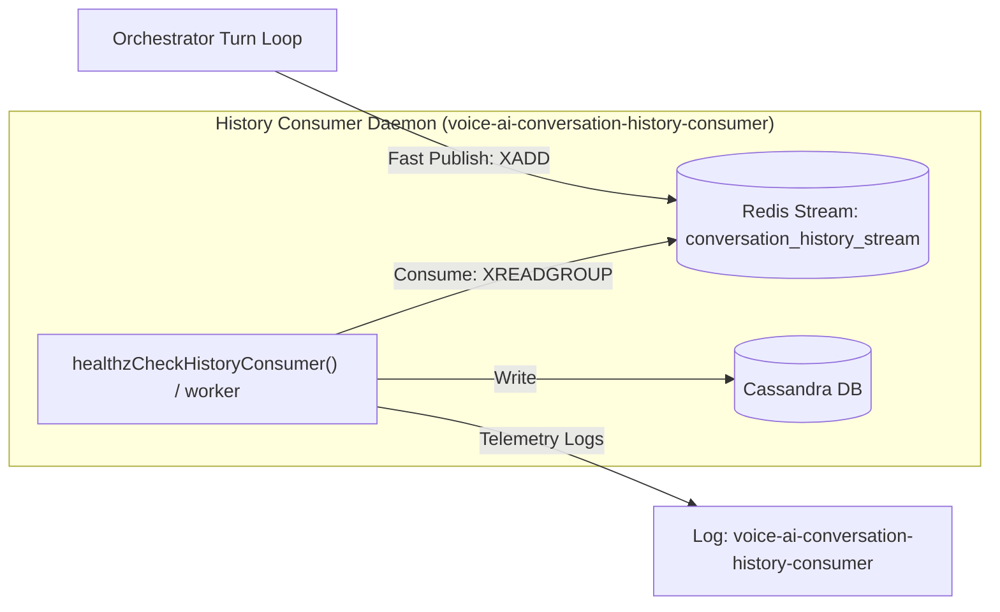

# Decoupled Conversation History Consumer Plan

This plan outlines the architecture for introducing a dedicated **Conversation History Consumer** (`"voice-ai-conversation-history-consumer"`). This decouples the durable Cassandra writes from the live orchestrator response thread using Redis Streams (serving as a local stand-in for Apache Kafka).

---

## 1. Architectural Architecture Flow



---

## 2. Telemetry and APM Registration

Under this setup, the consumer daemon will run under its own dedicated APM/logging boundary:
* **Service Name**: `voice-ai-conversation-history-consumer`
* **Parent Namespace**: `voice-ai-agent` (allowing unified end-to-end trace correlation)

---

## 3. Implementation Details

### A. The Producer: Publishing to Redis Stream
In `internal/llm-orchestrator-server/supervisor.go`, we modify `LogConversationTurn` to write to Redis Stream instead of making a direct async call to Cassandra:

```go
func (s *TurnSupervisor) LogConversationTurn(ctx context.Context, userID, sessionID, role, transcript, intent, action, result string) {
    seqKey := fmt.Sprintf("session:%s:seq", sessionID)
    seq, _ := s.Redis.Client.Incr(ctx, seqKey).Result()

    // Package the turn event
    payload := map[string]interface{}{
        "user_id":         userID,
        "session_id":      sessionID,
        "turn_seq":        int(seq),
        "role":            role,
        "transcript":      transcript,
        "intent":          intent,
        "action":          action,
        "result":          result,
        "timestamp":       time.Now().Format(time.RFC3339Nano),
    }

    // Publish to the stream (low-latency, fire-and-forget)
    err := s.Redis.Client.XAdd(ctx, &redis.XAddArgs{
        Stream: "conversation_history_stream",
        Values: payload,
    }).Err()

    if err != nil {
        log.Printf("[Stream Error] Failed to publish turn to history stream: %v", err)
    }
}
```

---

### B. The Consumer: Reading and Sinking to Cassandra
The consumer daemon runs as a background process (or goroutine started in `cmd/llm-orchestrator-server/main.go`). It uses `XReadGroup` to guarantee reliable, at-least-once delivery.

**Go Code Template**:
```go
func StartHistoryConsumer(ctx context.Context, r *db.RedisManager, c *db.CassandraManager) {
    logger := telemetry.Logger("voice-ai-conversation-history-consumer")
    stream := "conversation_history_stream"
    group := "cassandra_history_group"
    consumer := "consumer-node-1"

    // Initialize group if not exists
    _ = r.Client.XGroupCreateMkStream(ctx, stream, group, "$").Err()

    go func() {
        for {
            select {
            case <-ctx.Done():
                return
            default:
                // Read new messages from stream
                entries, err := r.Client.XReadGroup(ctx, &redis.XReadGroupArgs{
                    Group:    group,
                    Consumer: consumer,
                    Streams:  []string{stream, ">"},
                    Count:    10,
                    Block:    2 * time.Second,
                }).Result()

                if err != nil {
                    continue
                }

                for _, streamEntry := range entries {
                    for _, msg := range streamEntry.Messages {
                        start := time.Now()
                        
                        // 1. Unpack values
                        userID, _ := msg.Values["user_id"].(string)
                        sessionID, _ := msg.Values["session_id"].(string)
                        turnSeqStr, _ := msg.Values["turn_seq"].(string)
                        turnSeq, _ := strconv.Atoi(turnSeqStr)
                        role, _ := msg.Values["role"].(string)
                        transcript, _ := msg.Values["transcript"].(string)
                        intent, _ := msg.Values["intent"].(string)
                        action, _ := msg.Values["action"].(string)
                        result, _ := msg.Values["result"].(string)

                        // 2. Write to Cassandra
                        bgCtx, cancel := context.WithTimeout(context.Background(), 3*time.Second)
                        writeErr := c.LogTurn(bgCtx, userID, sessionID, turnSeq, role, transcript, intent, action, result)
                        cancel()

                        duration := time.Since(start)
                        durationMS := float64(duration.Nanoseconds()) / 1e6

                        logRecord := telemetry.StructuredLog{
                            Timestamp:           time.Now(),
                            Level:               "INFO",
                            Logger:              "voice-ai-conversation-history-consumer",
                            Message:             "Processed turn write to Cassandra",
                            Duration:            duration.String(),
                            DurationMS:          durationMS,
                            SessionID:           sessionID,
                            DBSystem:            "cassandra",
                            DBCollection:        "conversations",
                            DBOperation:         "insert",
                        }

                        if writeErr != nil {
                            logRecord.Level = "ERROR"
                            logRecord.Message = fmt.Sprintf("Failed to write to Cassandra: %v", writeErr)
                            logger.ErrorContext(ctx, "history_write_failed", slog.Any("details", logRecord))
                        } else {
                            // Acknowledge the message in Redis Stream
                            r.Client.XAck(ctx, stream, group, msg.ID)
                            logger.InfoContext(ctx, "history_write_success", logRecord.SlogArgs()...)
                        }
                    }
                }
            }
        }
    }()
}
```

---

### C. The Consumer Health Check HTTP Endpoint (`/healthz`)
Instead of running a background goroutine that pushes heartbeats, the History Consumer exposes an HTTP server on a dedicated port (e.g., `9085`) with a `/healthz` endpoint. When probed, it dynamically checks Redis connectivity, Cassandra connectivity, and the consumer group message backlog (lag).

**Go HTTP Handler Code**:
```go
type HealthStatus struct {
	Status     string            `json:"status"`
	Redis      string            `json:"redis"`
	Cassandra  string            `json:"cassandra"`
	PendingLag int64             `json:"pending_lag"`
	Error      string            `json:"error,omitempty"`
}

func handleConsumerHealth(w http.ResponseWriter, r *http.Request, redisClient *redis.Client, cassandraSession *gocql.Session) {
	w.Header().Set("Content-Type", "application/json")
	status := HealthStatus{
		Status: "healthy",
		Redis:  "up",
		Cassandra: "up",
	}
	hasError := false

	// 1. Check Redis Connection
	if err := redisClient.Ping(r.Context()).Err(); err != nil {
		status.Redis = "down"
		status.Status = "unhealthy"
		status.Error = "Redis ping failed: " + err.Error()
		hasError = true
	}

	// 2. Check Cassandra Connection
	if cassandraSession == nil || cassandraSession.Closed() {
		status.Cassandra = "down"
		status.Status = "unhealthy"
		status.Error = "Cassandra session is closed or nil"
		hasError = true
	}

	// 3. Check Redis Stream Pending Backlog (Lag)
	if !hasError {
		pending, err := redisClient.XPending(r.Context(), "conversation_history_stream", "cassandra_history_group").Result()
		if err != nil {
			status.Status = "unhealthy"
			status.Error = "Failed to query Redis stream backlog: " + err.Error()
			hasError = true
		} else {
			status.PendingLag = pending.Count
			// If message backlog is too high, mark as degraded or unhealthy
			if pending.Count > 100 {
				status.Status = "degraded"
				status.Error = fmt.Sprintf("High backlog lag: %d unacknowledged messages", pending.Count)
				w.WriteHeader(http.StatusServiceUnavailable)
				_ = json.NewEncoder(w).Encode(status)
				return
			}
		}
	}

	if hasError {
		w.WriteHeader(http.StatusServiceUnavailable)
	} else {
		w.WriteHeader(http.StatusOK)
	}
	_ = json.NewEncoder(w).Encode(status)
}
```
