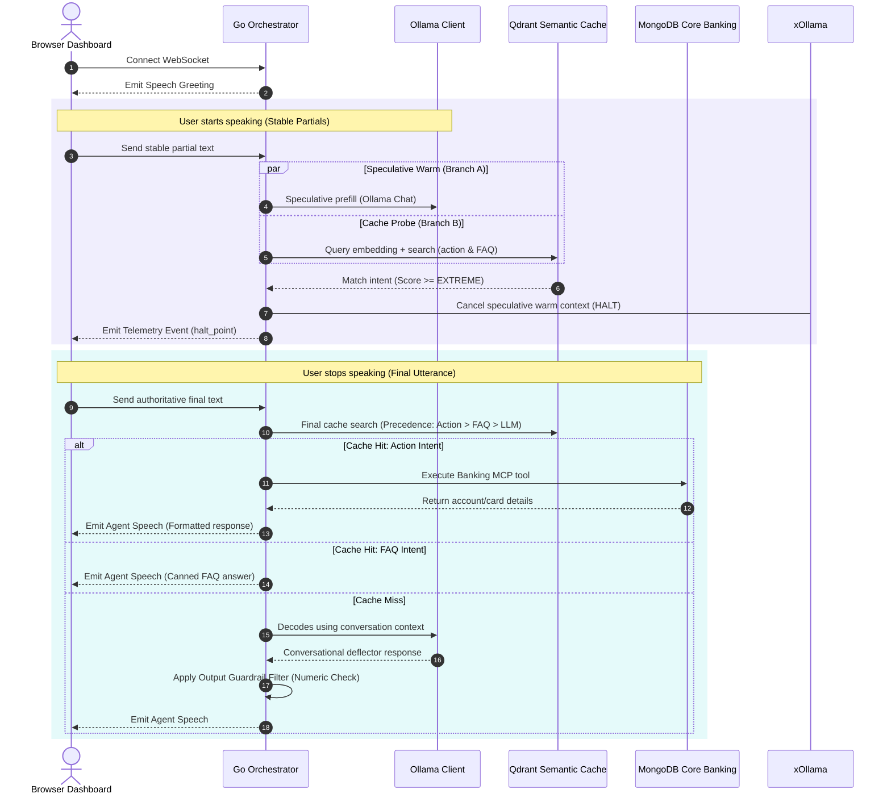

# Voice AI Banking Support Agent — Architecture & Implementation

A local-first, concurrent voice banking support agent built with **Go**, **Qdrant**, **Redis**, and **Ollama**. This implementation implements the **parallel LLM warming** and **mid-flight cache interception** (v2) design.

---

## 🏗️ Architecture Overview

The Go Orchestrator manages a dual-branch state machine on WebSocket connection:



---

## 📂 Codebase Structure

All components are fully implemented:

*   **Entrypoint:** [main.go](file:///Users/dharmendra/golang-projects/banking-voice-ai-support-agent-v2/main.go) — Coordinates database connections, REST APIs, WebSockets, and runtime state tracking.
*   **Orchestrator Supervisor:** [orchestrator/supervisor.go](file:///Users/dharmendra/golang-projects/banking-voice-ai-support-agent-v2/orchestrator/supervisor.go) — Handles the parallel Branch A & B state machine, early-halt execution, final-transcript dispatch, transaction confirmations, and output guardrails.
*   **Ollama REST Client:** [ollama/ollama.go](file:///Users/dharmendra/golang-projects/banking-voice-ai-support-agent-v2/ollama/ollama.go) — Embeddings interface and chat completions supporting context cancellation.
*   **Semantic Cache Store:** [db/qdrant.go](file:///Users/dharmendra/golang-projects/banking-voice-ai-support-agent-v2/db/qdrant.go) — Cosine similarity search indexes, collection setup, and automated data seeding.
*   **Ephemeral Session Store:** [db/redis.go](file:///Users/dharmendra/golang-projects/banking-voice-ai-support-agent-v2/db/redis.go) — Stores multi-turn chat context and writes audit logs using Redis Streams.
*   **Core Banking System:** [db/mongo.go](file:///Users/dharmendra/golang-projects/banking-voice-ai-support-agent-v2/db/mongo.go) — Customer records, account balances, credit cards, transaction history, and a unique index on the client `unique_ref_no` (simulates the bank's duplicate-transaction rejection).
*   **Banking MCP Gateway:** [mcp/banking_mcp.go](file:///Users/dharmendra/golang-projects/banking-voice-ai-support-agent-v2/mcp/banking_mcp.go) — Acts as the Tool call interface mapping intents to MongoDB routines.
*   **Interactive Control Dashboard:** [frontend/index.html](file:///Users/dharmendra/golang-projects/banking-voice-ai-support-agent-v2/frontend/index.html) — Rich web interface supporting browser Web Speech STT/TTS and real-time supervisor logs.
*   **Container Setup:** [Dockerfile](file:///Users/dharmendra/golang-projects/banking-voice-ai-support-agent-v2/Dockerfile) — Packs the compiled Go app and frontend assets into a lightweight alpine image.
*   **Local L7 Load Balancer:** [nginx.conf](file:///Users/dharmendra/golang-projects/banking-voice-ai-support-agent-v2/nginx.conf) — Directs WebSocket and HTTP traffic in round-robin fashion across 3 backend instances.
*   **Docker Stack:** [docker-compose.yml](file:///Users/dharmendra/golang-projects/banking-voice-ai-support-agent-v2/docker-compose.yml) — Co-locates databases, Nginx, and three scaled orchestrator instances under the same virtual network.

---

## 🛠️ How to Run & Test

### 1. Build and Start the Stack
Build and launch all databases, 3 orchestrators, and the Nginx load balancer together:
```bash
./script.sh
```
*(The script installs all dependencies, downloads Ollama models, builds the Go image, spins up the containers, launches the web dashboard, and trails the logs in the console.)*

### 3. Test Scenarios in Dashboard

Open [http://localhost:8080](http://localhost:8080) in your web browser (Safari or Chrome recommended for native Speech API support) and click the animated microphone button to speak:

*   **Cache Hit (Action):** Say *"what is my account balance?"* or *"check my balance please"*.
    > [!NOTE]
    > Notice the telemetry logs: `cache_probe` executes on partial tokens. The instant you say *"what is my balance"*, the score jumps past `EXTREME (0.96)`. The `halt_point` event fires instantly, canceling the background warming branch.
*   **Cache Hit (FAQ):** Ask *"what are the branch opening hours?"*. The final dispatch routes directly to the FAQ collection, returning the correct bank operating schedule.
*   **Mutating Transaction (Confirmation & `unique_ref_no`):** Say *"transfer 500 to account 987654"*.
    > [!IMPORTANT]
    > Mutating actions require confirmation. The agent will speak *"Please confirm: Do you want to transfer 500.00 INR to account 987654?"* and prompt you. Say *"yes"* or click **Confirm**. The transaction executes idempotently on MongoDB, and the Core Banking portal on the left instantly updates your balance to **₹4,067.89**!
*   **Cache Miss & LLM Deflector:** Ask a general question (e.g. *"how was your day?"*). It misses both cache stores and fallbacks to Ollama (`gemma2:2b`), which responds as conversational glue.
*   **Output Guardrail Filter:** Ask the LLM to invent an APR or fee (e.g. *"tell me the credit card interest rate"*). The LLM's response goes through the **Output Guardrail Filter**. Because the interest rate number wasn't provided by a trusted source (API/FAQ), the filter trips, suppresses the hallucination, and offers a human handoff.
*   **Load-Shedding Knob:** Toggle **Speculative LLM Warming** off in the telemetry panel. Speak a phrase, and observe the logs: warming is skipped (`warm_shed` event logs), falling back to sequential execution.

---

## 📈 Structured Telemetry Logs

The supervisor outputs structured telemetry events to help verify the parallel warming efficiency:

*   `warm_start` — Emitted when speculative KV-cache warming begins on stable partials.
*   `cache_probe` — Emitted on each stable partial token search with similarity scores.
*   `halt_point` — Emitted the moment score >= `EXTREME` (aborts warming context).
*   `dispatch` — Final routing decision (`action`, `faq`, or `llm`).
*   `final_reconcile` — Checks if the final utterance matches the early intercepted intent.
*   `warm_outcome` — Records prefill tokens spent, whether they were used or discarded, and whether GPU compute was reclaimed.
