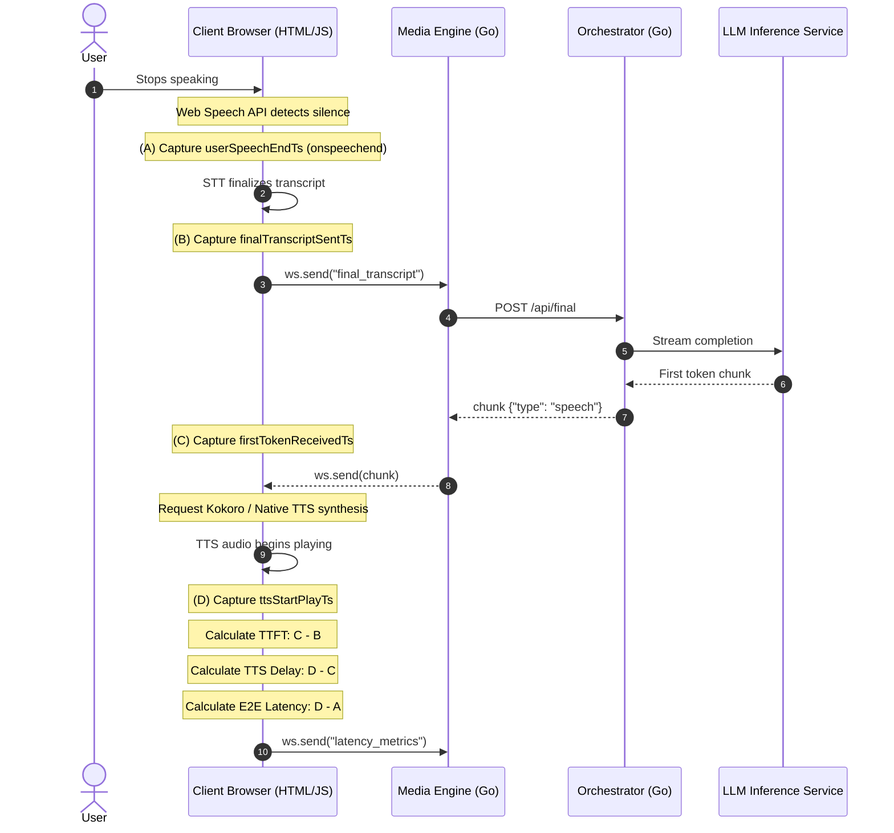

# Technical Implementation Plan: Latency Measurement Expansion

This plan outlines the design and step-by-step changes needed to measure and log:
1. **Time to First Token (TTFT)**: Time elapsed from sending the final transcript to receiving the first streamed text/speech token.
2. **TTS Playback Start Latency (First Words)**: Time elapsed from receiving a text token to the audio actually playing.
3. **End-to-End (E2E) Perceived Latency**: Time elapsed from when the user physically stops speaking to when the TTS audio starts playing.

---

## 1. Architectural Sequence



---

## 2. Detailed Implementation Checklist

### Phase 1: Frontend Instrumentation (`frontend/index.html`)

We will instrument the Web Speech API event handlers and the audio/speechSynthesis execution paths to collect precise timestamps.

#### 1. Add Timestamp Tracking Variables
In the script tag, add global variables to track turn-level timestamps:
```javascript
let userSpeechEndTs = 0;        // Timestamp when user stopped speaking (onspeechend)
let finalTranscriptSentTs = 0;  // Timestamp when final_transcript was sent to backend
let firstTokenReceivedTs = 0;   // Timestamp when first 'speech' chunk was received
let ttsStartPlayTs = 0;         // Timestamp when first chunk started playing
let isFirstSpeechChunk = false; // Flag to capture only the first chunk of a turn
```

#### 2. Capture Acoustic End of Speech
Hook into `SpeechRecognition.onspeechend` to capture the moment of silence detection:
```javascript
recognition.onspeechend = () => {
    userSpeechEndTs = Date.now();
    console.log("[STT] User ended speaking (acoustic end).");
};
```

#### 3. Capture Transcript Submission Time
Update the `finalTranscript` handler inside `recognition.onresult`:
```javascript
if (finalTranscript) {
    const cleanFinal = finalTranscript.trim();
    appendChatMessage('user', cleanFinal, false);

    finalTranscriptSentTs = Date.now();
    // Fallback in case onspeechend didn't fire or was skipped
    if (userSpeechEndTs === 0) {
        userSpeechEndTs = finalTranscriptSentTs;
    }
    ignoreIncomingSpeech = false;
    isFirstSpeechChunk = true; // Reset flag for new response turn

    if (socket && socket.readyState === WebSocket.OPEN) {
        socket.send(JSON.stringify({
            type: 'final_transcript',
            turn_id: currentUtteranceId,
            text: cleanFinal,
            timestamp_ms: finalTranscriptSentTs
        }));
    }
}
```

#### 4. Capture First Token Arrival
In `handleBackendMessage` under `case 'speech':`, record the first token timestamp:
```javascript
case 'speech':
    if (ignoreIncomingSpeech) break;
    if (isFirstSpeechChunk) {
        firstTokenReceivedTs = Date.now();
    }
    // ... existing speech logic
```

#### 5. Hook into Audio/TTS Play Start
Instrument the audio elements and native TTS callbacks to catch the exact moment audio begins playing.

*   **For Kokoro / Google Fallback (HTML5 Audio):**
    Modify `processAudioQueue` where the `Audio` object is created and add a `playing` event listener:
    ```javascript
    const isFirstAudioChunkOfTurn = isFirstSpeechChunk;
    isFirstSpeechChunk = false; // consume flag

    activeAudio = new Audio(audioUrl);
    activeAudio.addEventListener('playing', () => {
        if (isFirstAudioChunkOfTurn) {
            recordAndReportTTSStart();
        }
    });
    ```

*   **For System Native TTS (Web Speech API):**
    Modify `speakNativeTTSChunk` to add an `onstart` event listener:
    ```javascript
    const isFirstAudioChunkOfTurn = isFirstSpeechChunk;
    isFirstSpeechChunk = false; // consume flag

    const utterance = new SpeechSynthesisUtterance(text);
    utterance.onstart = () => {
        if (isFirstAudioChunkOfTurn) {
            recordAndReportTTSStart();
        }
    };
    ```

#### 6. Calculate & Report Metrics
Add the report method to compute latencies and send them to the backend:
```javascript
function recordAndReportTTSStart() {
    ttsStartPlayTs = Date.now();

    const ttft = firstTokenReceivedTs - finalTranscriptSentTs;
    const ttsStartDelay = ttsStartPlayTs - firstTokenReceivedTs;
    const e2eLatency = ttsStartPlayTs - userSpeechEndTs;

    console.log(`[Latency Metrics] TTFT: ${ttft}ms | TTS Delay: ${ttsStartDelay}ms | E2E: ${e2eLatency}ms`);

    // Send metrics back to backend via WebSocket
    if (socket && socket.readyState === WebSocket.OPEN) {
        socket.send(JSON.stringify({
            type: 'latency_metrics',
            turn_id: currentUtteranceId,
            payload: {
                ttft_ms: ttft,
                tts_playback_start_ms: ttsStartDelay,
                e2e_latency_ms: e2eLatency
            }
        }));
    }

    // Optionally update UI elements
    updateLatencyUI(ttft, ttsStartDelay, e2eLatency);
}
```

#### 7. Update UI Layout
Modify `frontend/index.html` to add visual slots for the new metrics in `.latency-badge`:
```html
<div class="latency-badge" style="display: flex; flex-direction: column; gap: 0.25rem;">
    <div>Post-Speech (Turn): <span class="latency-val" id="latency-metric">-- ms</span></div>
    <div>TTFT (Client): <span class="latency-val" id="ttft-metric">-- ms</span></div>
    <div>TTS Playback Delay: <span class="latency-val" id="tts-metric">-- ms</span></div>
    <div>End-to-End Latency: <span class="latency-val" id="e2e-metric">-- ms</span></div>
</div>
```

---

### Phase 2: Telemetry Logger Updates (`internal/telemetry/structured_logger.go`)

Update `StructuredLog` to support the new metrics in backend structured logs.

#### 1. Add struct fields to `StructuredLog`
```go
// in StructuredLog struct
TTFTMs              float64 `json:"ttft_ms,omitempty"`
TTSPlaybackStartMs  float64 `json:"tts_playback_start_ms,omitempty"`
E2ELatencyMs        float64 `json:"e2e_latency_ms,omitempty"`
```

#### 2. Update `LogValue()` to marshal these fields:
```go
if l.TTFTMs != 0 {
    attrs = append(attrs, slog.Float64("ttft_ms", l.TTFTMs))
}
if l.TTSPlaybackStartMs != 0 {
    attrs = append(attrs, slog.Float64("tts_playback_start_ms", l.TTSPlaybackStartMs))
}
if l.E2ELatencyMs != 0 {
    attrs = append(attrs, slog.Float64("e2e_latency_ms", l.E2ELatencyMs))
}
```

---

### Phase 3: Media Engine Updates (`cmd/media-engine/main.go`)

Handle the incoming `latency_metrics` WebSocket message type and log it.

#### 1. Update `ClientWSMessage` Type comments
```go
// in ClientWSMessage
Type        string `json:"type"` // 'config', 'partial_transcript', 'final_transcript', 'confirmation', 'latency_metrics'
```

#### 2. Add WebSocket Message Handler
Add a switch case inside the message read loop of `handleWebSocket`:
```go
case "latency_metrics":
    payload, ok := msg.Payload.(map[string]any)
    if ok {
        ttft, _ := payload["ttft_ms"].(float64)
        ttsStart, _ := payload["tts_playback_start_ms"].(float64)
        e2e, _ := payload["e2e_latency_ms"].(float64)

        logRecord := telemetry.StructuredLog{
            Timestamp:          time.Now(),
            Level:              "INFO",
            Message:            "Client-reported latency metrics",
            Logger:             "media-engine",
            TTFTMs:             ttft,
            TTSPlaybackStartMs: ttsStart,
            E2ELatencyMs:       e2e,
            SessionID:          sessionID,
            TurnID:             msg.TurnID,
        }
        telemetry.Logger("media-engine").InfoContext(r.Context(), "client_latency_metrics", logRecord.SlogArgs()....)
    }
```

---

## 3. Verification Plan

1. **Local Test Run**:
   Start the services and speak into the interface. Verify the browser UI updates the three new metrics values correctly.
2. **Log Verification**:
   Check the media-engine logs. Verify that `client_latency_metrics` log lines are emitted and contain the keys `ttft_ms`, `tts_playback_start_ms`, and `e2e_latency_ms`.
3. **Accuracy Checks**:
   Validate that `E2ELatencyMs` is roughly equal to `TTFTMs` + `TTSPlaybackStartMs` + browser silence-detection latency.
